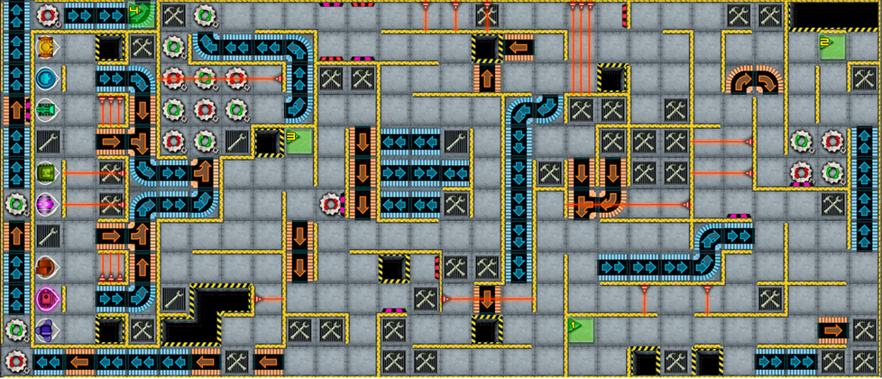

# INF112 Systemutvikling
https://www.uib.no/emne/INF112

Praktisk emne med stort fokus på programvareutvikling. 
Planlegging, organisering, problemstillinger, analysere og gjennomføring ved lagarbeid. 

Vi lagde Roborally, et turbasert spill der man navigerer hver sin robot. 

## Known bugs
Currently throws "WARNING: An illegal reflective access operation has occurred", 
when the java version used is >8. This has no effect on function or performance, and is just a warning.

